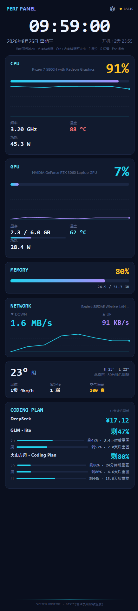

# PerfPanel — 440×1920 / 1920×440 Secondary-Screen Performance Monitor

**English** | [简体中文](README.zh-CN.md)

A dark, tech-style hardware monitoring panel built natively in WPF, designed for tall or wide USB-C portable monitors used as extended displays on Windows. The portrait 440×1920 single-column layout and the landscape 1920×440 two-column layout share the same card components, auto-switch by the display's shape, and can also be set manually.

## Screenshot



## Features

- **Clock**: live time, date & weekday, uptime
- **CPU**: large usage readout + 120s history graph, frequency (LHM core clocks, falling back to WMI effective frequency that can exceed the nominal rate under boost), temperature, power draw, fan speed (desktop boards whose SuperIO chip exposes a fan sensor; some mini-PC / laptop EC fans are not readable)
- **GPU**: usage + history graph, VRAM usage (progress bar), temperature, power draw, fan (rows hide automatically when the iGPU exposes no sensor; AMD iGPU temperature comes from its VR SoC sensor)
- **Notes / todos**: a card showing a one-line sticky note and a todo list — click a row on the panel to toggle it done; rotating focus reminders (e.g. "stay on your review plan", "check the revision kanban") highlight on a 15–90 min cycle. Content persists in `notes.json` next to the exe, editable in Settings (S); landscape mode shows a slim notes strip at the bottom
- **RAM**: usage percentage + used/total
- **Network**: real-time up/down speeds + download history graph, auto-selects the active adapter
- **Weather**: Open-Meteo free international source (no key; optional Amap key switches to a more stable China source), IP-based location (editable via `weather.json`)
- **Coding Plan quota**: DeepSeek balance, Zhipu GLM, Volcano Ark Agent/Coding Plan remaining quota with reset countdowns
- **Graceful degradation**: without admin rights, temperature/power/fan cards hide automatically and the corner shows `BASIC`; running as admin shows `FULL`
- **Portrait/landscape layouts**: in landscape 1920×440 the clock sits centered, CPU/GPU take the left half side by side, and RAM+network / weather+quota stack in the right columns; `auto` picks by the display's shape, or pin the direction via Settings, `config.json`, or the command line

## Run

### From source (dev/debug)

```bash
dotnet run --project src/PerfPanel                # fullscreen (restores deps & builds on first run)
dotnet run --project src/PerfPanel -- --windowed  # debug: windowed on primary screen, for machines without a secondary display
```

Requires the .NET SDK 8.0+ (newer SDKs can still build the net8.0 target). Note that `dotnet run` is a normal-privilege process, so the corner shows `BASIC` (no CPU temperature/power/fan). Run it from an admin terminal, or build the exe and right-click → *Run as administrator* for full sensors.

### Built binary

```
PerfPanel.exe            # fullscreen: locates the 440×1920 / 1920×440 secondary display (borderless fill, Esc to quit)
PerfPanel.exe --windowed # debug: windowed on primary screen, freely resizable
PerfPanel.exe --landscape / --portrait   # force landscape / portrait (auto = by display shape, the default)
```

Requires the .NET 8 desktop runtime (WindowsDesktop 8.0.x).

**For full temperature/fan/power: right-click → "Run as administrator"** (LibreHardwareMonitor needs its Ring0 driver to read CPU sensors; NVIDIA GPU temperature/VRAM work without admin).

## Autostart (built in, one-line CLI)

```
PerfPanel.exe --autostart-on       # enable: as admin → scheduled task (highest privileges, full sensors)
                                   #          normal privileges → registry Run key (basic mode)
PerfPanel.exe --autostart-off      # disable (cleans up both channels)
PerfPanel.exe --autostart-status   # show current registration state
```

The easiest way: double-click the ready-made scripts in `dist/` —

- `开机自启-开启(管理员,推荐).bat` ("Autostart on, admin, recommended"): one UAC prompt, registers a scheduled task; full sensors available right after boot
- `开机自启-开启(普通权限).bat` ("Autostart on, normal privileges"): no UAC prompt, but no CPU temperature/power/fan after boot
- `开机自启-关闭.bat` ("Autostart off")

> `dist/PerfPanel-开机自启-管理员.xml` is a template for manual import via `schtasks /create /xml ...` — rarely needed, since the scripts above register everything automatically. If you do import it manually, first change the path in its `<Command>` element to the actual location of `PerfPanel.exe` on your machine.

## Weather: custom location + refresh countdown

- The weather card shows "City · refreshes in N min" and auto-refreshes every 30 minutes
- China enhancement: Settings (`S` or ⚙) → "Data Source" — fill in an Amap *Web Service* key (free at [console.amap.com](https://console.amap.com), choose the "Web Service" type) to switch weather & geocoding to Amap: more stable inside China, with address-level precision. Leave it empty to keep Open-Meteo
- Custom city (Open-Meteo free geocoding; Chinese/pinyin/English all work):

```
PerfPanel.exe --set-city Shanghai
```

or double-click `dist/设置天气城市.bat` ("Set weather city") and type a city name; or edit `weather.json` next to the exe directly:

```json
{"lat": 31.2304, "lon": 121.4737, "city": "Shanghai"}
```

## Coding Plan quota monitoring

The CODING PLAN card shows each subscription's remaining quota and reset countdowns (auto-refresh every 15 minutes; last good values are kept on failure):

| Provider | Query | Shown |
| --- | --- | --- |
| DeepSeek | official `/user/balance` API | account balance (¥) |
| Zhipu GLM Coding Plan | unofficial API (same as CC Switch) | 5h/weekly window percentages + reset countdown |
| Volcano Ark Agent/Coding Plan | unofficial console OpenAPI (same as CC Switch) | 5h/weekly/monthly quota + reset countdown |

**Where to put keys**: Settings (`S` or ⚙) → "Coding Plan Quota":

- **DeepSeek**: the API key from [platform.deepseek.com](https://platform.deepseek.com)
- **Zhipu GLM**: the API key from [open.bigmodel.cn](https://open.bigmodel.cn) (personal tier; GLM API keys not dedicated to Coding Plan also work)
- **Volcano Ark**: the **IAM AccessKey ID + Secret Access Key** from the Volcengine console ([volcengine.com](https://www.volcengine.com) → avatar at the top right → API access keys) — **not** the Ark inference API key. Quota queries go through the console-plane OpenAPI with AK/SK signing, so inference keys won't work

Each item has "Save & Test" for instant validation; leave it empty and the panel simply skips that provider. Keys are stored in `config.json` next to the exe.

> The GLM/Volcano integrations use unofficial APIs (mirroring the CC Switch implementation), so upstream field changes can break queries — on failure the panel shows the reason. The last raw Volcano response is saved to `volc-last-response.json` next to the exe, which helps when checking for missing/renamed fields.

## Notes / todos / focus reminders

The FOCUS card (portrait) or bottom notes strip (landscape) turns the secondary display into a focus board:

- **Sticky note**: your one-line current goal (e.g. "focus on Calculus chapter 3"), always visible in amber
- **Todos**: click a row right on the panel to toggle done (finished items get struck through and dimmed); pending items sort first
- **Focus reminders**: every 15/30/45/60/90 minutes one rotating message highlights for 90 seconds — defaults include "stay on your review, don't get distracted" and "check the revision kanban"; otherwise the card shows a countdown and the next message preview

Edit everything in Settings (S or ⚙) → "Notes / focus": sticky note, add/remove todos, cycle length, custom messages (one per line). Content persists in `notes.json` next to the exe; untick "show notes card" to hide the whole thing.

## Build

```bash
# .NET 8 SDK required
dotnet build -c Release
dotnet publish -c Release -r win-x64 --self-contained false -p:PublishSingleFile=true
# output: src/PerfPanel/bin/Release/net8.0-windows/win-x64/publish/PerfPanel.exe (single file, ~3.7 MB)
```

Self-contained build (no runtime needed, ~150 MB):

```bash
dotnet publish -c Release -r win-x64 --self-contained true -p:PublishSingleFile=true
```

> The repo ships no build output. The `.bat` scripts in `dist/` look for `PerfPanel.exe` in their own directory — copy the published exe into `dist/` before double-clicking them. (CLI flags such as `--autostart-on` also work with `dotnet run`; put them after `--`.)

## Architecture

```
src/PerfPanel/
├── MainWindow.xaml(.cs)        # portrait 440×1920 / landscape 1920×440 dual layout (shared cards), multi-monitor placement, 1s refresh loop
├── Controls/HistoryGraph.cs    # StreamGeometry hand-drawn history graphs (no chart library)
├── Models/SensorSnapshot.cs    # unified snapshot model (nullable fields = auto-hidden in UI)
└── Services/
    ├── HardwareMonitorService.cs  # LibreHardwareMonitor: temp/fan/power/frequency/VRAM
    ├── FallbackMonitorService.cs  # no-admin fallback: WMI localized perf classes + GlobalMemoryStatusEx
    ├── MonitorAggregator.cs       # dual-source aggregation, field-level merging
    ├── NetworkMonitorService.cs   # adapter throughput (sticky adapter choice)
    ├── WeatherService.cs          # Open-Meteo + geocoding, custom location, silent failure
    ├── AutostartService.cs        # autostart: scheduled task / registry dual channel
    └── MonitorHelper.cs           # EnumDisplayMonitors / SetWindowPos P/Invoke (no WinForms)
```

Design notes for future improvements (more sensors, appearance customization, orientation, todos, …) live in [docs/设计方案.md](docs/设计方案.md) (Chinese).

- Data sources: LibreHardwareMonitorLib **0.9.4** (pinned on purpose: 0.9.5+ reads constant 0 for CPU sensors on some AMD laptops such as the 5800H; MIT) + Windows WMI
- Refresh: 1-second DispatcherTimer, sampling on background threads, render-only UI thread
- Measured footprint: ~130 MB private / ~190 MB working set (typical for WPF + LHM + WMI; about half of browser-based alternatives)

## License

[MIT](LICENSE)
